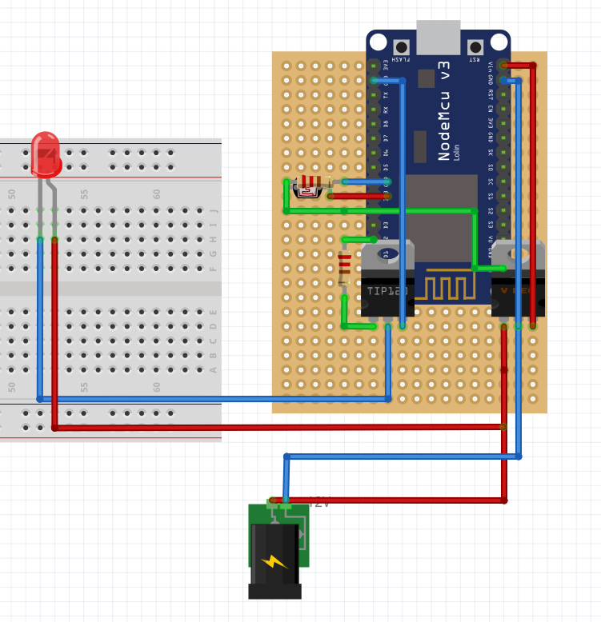
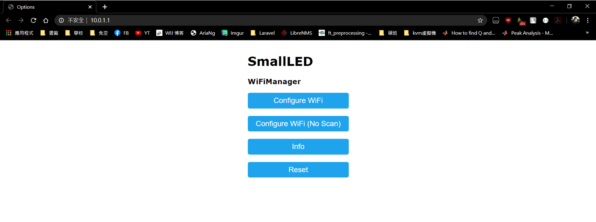

# Smart_LED
## 介紹

**智慧燈具 能根據設定的目標LUX達到補光的作用**

### Nodemcu電路圖

### 設定網路畫面

## 功能

1. **啟動流程**
2. **燈具WIFI熱點**
3. **補光機制**
4. **自訂補償的目標 LUX**
5. **燈具LUX的計算方式**
6. **抓取 IP** 
7. **抓取 LUX 及燈具亮度百分比**
8. **設定 LED 模式**
9. **設定排程**
10. **排程說明**
11. **取得排程、目標LUX、LED模式參數狀態**
12. **燈具規格**

## 執行流程

1. **在燈具插電後**
2. **會先連結到 WIFI**
3. **如果沒連接到的話燈具會分享熱點讓你可以去修改WIFI的連線**
4. **連結到 WIFI 後**
5. **燈具會閃一下**
6. **接下來會從 time.google.com 的 NTP 伺服器**
7. **抓取時間資料 抓取成功後**
8. **燈具會閃一下**
9. **到這裡就可以開始進行設定排程以及抓取LUX和燈具亮度百分比資料的動作了**
10. **注意 未設定排程前 以及 12 PM ～ 6 AM 燈具是不會亮的**
